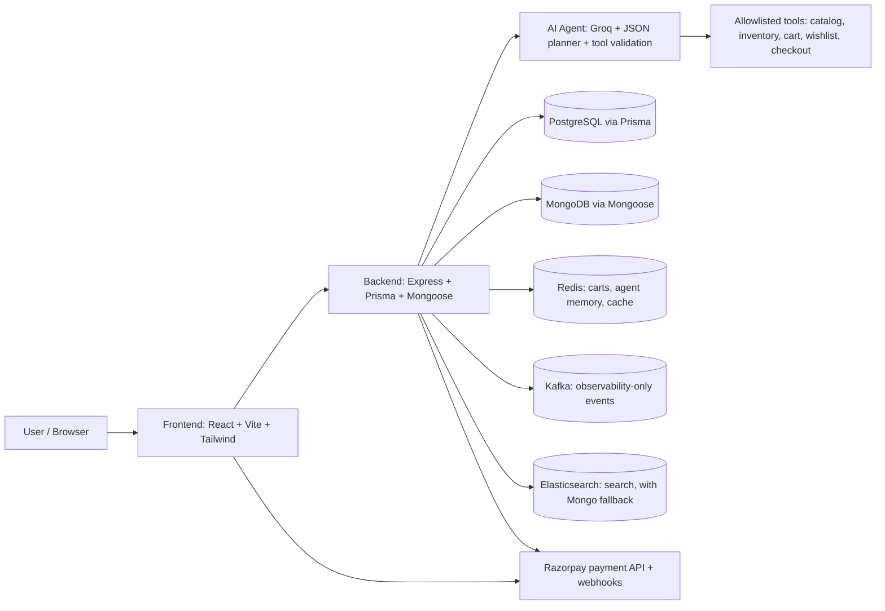

# NeuralShop

NeuralShop is a full-stack commerce application with an AI shopping agent that supports natural-language product discovery, cart and wishlist actions, order preparation, and backend-verified checkout. The system uses allowlisted tools to plan commerce actions, enforces inventory and payment safeguards in the backend, and only surfaces successful checkout state after backend confirmation.

## Track Alignment — Agentic Commerce

This project is best classified as an agentic commerce system: an AI agent that plans and executes multi-step shopping actions (search → compare → cart → checkout) rather than answering single-turn questions, backed by a verified payment lifecycle and transactional inventory handling.

- conversational product discovery and recommendation flow
- multi-step commerce orchestration through bounded tool calls and deterministic fallbacks
- backend-confirmed payment workflow instead of browser-only success assumptions
- order and inventory protection using transactional state transitions
- operational observability around agent actions, payments, and service health

## Live Demo

- Live app: https://neuralshop-usermode.onrender.com/
- GitHub: https://github.com/kushagraawasthi37/Neuralshop
- Demo video: not yet available

> Deployment note: the live environment should be treated as a demo deployment, not as proof that every non-critical service is fully healthy in all runtime states. Kafka and Elasticsearch are explicitly documented as non-critical or degraded in the architecture, and the repo keeps those limitations visible instead of hiding them.

## Architecture Overview



## Tech Stack

| Layer             | Technologies                                                                         |
| ----------------- | ------------------------------------------------------------------------------------ |
| Frontend          | React 19, Vite 8, React Router, TanStack Query, Zustand, Tailwind CSS, Framer Motion |
| Backend           | Node.js, Express 5, Prisma, Mongoose, PostgreSQL, MongoDB, Redis                     |
| AI / Agent        | Groq, JSON tool planning, Redis session memory, deterministic fallback planner       |
| Search / Indexing | Elasticsearch, MongoDB fallback                                                      |
| Messaging         | KafkaJS                                                                              |
| Payments          | Razorpay, raw-body HMAC webhook verification                                         |
| Auth / Security   | JWT, bcrypt, helmet, rate limiting, CORS, idempotency                                |
| Infrastructure    | Docker Compose, Node.js, npm                                                         |

## Quick Start

### Prerequisites

- OS: macOS, Linux, or Windows with Docker Desktop / WSL2
- Node.js 20+ recommended
- npm 10+
- Docker Desktop with Compose enabled
- Required keys in backend/.env:
  - GROQ_API_KEY
  - RAZORPAY_KEY_ID
  - RAZORPAY_KEY_SECRET
  - RAZORPAY_WEBHOOK_SECRET
  - DATABASE_URL
  - MONGO_URL
  - REDIS_URL
  - JWT_SECRET
  - JWT_REFRESH_SECRET
  - CLOUDINARY_NAME
  - CLOUDINARY_API_KEY
  - CLOUDINARY_API_SECRET
  - SENDGRID_API_KEY
  - SENDGRID_FROM_EMAIL

### 1) Clone and install

```bash
git clone https://github.com/kushagraawasthi37/Neuralshop.git
cd Neuralshop

cd backend
npm install
cp .env.example .env

cd ../frontend
npm install
```

### 2) Start infrastructure

```bash
cd ../backend
docker compose up -d postgres mongo redis zookeeper kafka elasticsearch
```

### 3) Prepare Prisma and fixtures

```bash
cd backend
npx prisma generate
npx prisma db push
npm run seed-fixtures
```

### 4) Start services

```bash
cd backend
npm run dev

cd ../frontend
npm run dev
```

The backend listens on the configured port, usually 8000 by default. The frontend starts on the Vite port, usually 5173.

## Key Features

- AI shopping agent with a bounded, allowlisted toolchain
- JSON planning and tool validation before any commerce action
- Redis-backed session memory and user behavior context
- Product search, recommendations, inventory checks, wishlist and cart actions
- Order preparation and checkout confirmation boundary before payment
- PostgreSQL order and payment state machine with guarded transitions
- Razorpay payment initiation and raw-byte HMAC webhook verification
- Payment-status polling on the frontend to avoid browser-callback-only success claims
- Idempotent payment and webhook processing
- Failed payment recovery and pre-checkout cart restoration
- Deterministic fallback plan when the LLM is unavailable

## Verified Results

The following metrics were measured by the project’s validation scripts and runtime checks:

- Integration suite (real Docker MongoDB/PostgreSQL/Redis/Kafka): 5/5 passed, clean exit 0
- Backend test suite: 15/15 passed
- Deterministic evaluator (20 cases): 85% task completion, 85% tool selection accuracy, 0/3 constraint violations
- Live LLM agent journey: 3 LLM calls, 2408ms latency, 100% constraint satisfaction, 0.00% hallucination, verified product "Black Wedding Jacket" at ₹7,499
- Catalog validation (29 queries / 9 products): 0.00% hallucination, 88.89% constraint satisfaction
- Groq latency benchmark (20 requests): p50 537ms, p95 670ms, avg 594ms, max 1303ms

## Challenges and Fixes

### 1) Duplicate/conflicting Razorpay webhook verification

The project initially risked verifying the same webhook against inconsistent secrets and re-serialized payload bytes. The fix was a single raw-byte HMAC verification point in the webhook middleware. This prevents a valid webhook from failing due to reserialization drift and centralizes the verification rule.

### 2) Frontend declared success too early

The frontend originally relied on the Razorpay browser callback alone. That creates a false-positive success state before the backend confirms payment. The fix was to gate the success UI behind backend payment-status polling rather than the browser callback alone.

### 3) Non-transactional, non-idempotent inventory deduction

Inventory reservation and order state transitions were vulnerable to duplicate event delivery and partial-failure mid-deduction. The fix was an atomic PostgreSQL transaction with an explicit checkout state machine and idempotency tracking for both payment initiation and webhook processing.

### 4) Deprecated Groq model caused silent fallback

The project hit a 404 model_not_found issue from a deprecated Groq model. The validator was effectively hiding the provider error by falling back silently, which made it look like the LLM path was working when it was not. The fix was to migrate the model to openai/gpt-oss-20b and surface provider failures directly instead of hiding them.

### 5) Native ESM import and startup failures

Startup issues came from missing file extensions, wrong relative import paths, and case-sensitive filename mismatches. The fix was to run the app cleanly, trace each failing startup point, and correct the import/build assumptions so the backend starts reliably in the actual environment.

## Scope & Limitations

1. Local Kafka plaintext vs TLS-expecting client is deferred; the system treats Kafka as observability-only.
2. Elasticsearch subCategory mapping is a known issue; MongoDB search fallback remains active.
3. No live Razorpay production capture has been tested; integration tests use real local services and simulated signed webhooks.
4. Authenticated mutation completion and attribution reconciliation are unmeasured.
5. There is no frontend automated test suite yet.

## Future Improvements

- RAG, embeddings, vector search, or a dedicated knowledge base
- real Razorpay capture testing in a production-like environment
- Elasticsearch mapping and relevance fix
- attribution reconciliation metrics for authenticated conversions
- frontend automated UI tests
- demo video for the project walkthrough

## Links

- GitHub: https://github.com/kushagraawasthi37/Neuralshop
- Live demo: https://neuralshop-usermode.onrender.com/
- Demo video: not yet available
- Contact: Kushagra Awasthi, GitHub profile: https://github.com/kushagraawasthi37

## Repository Documentation

- Backend documentation: ./backend/README.md
- Frontend documentation: ./frontend/README.md
- AI documentation: ./ai/README.md
